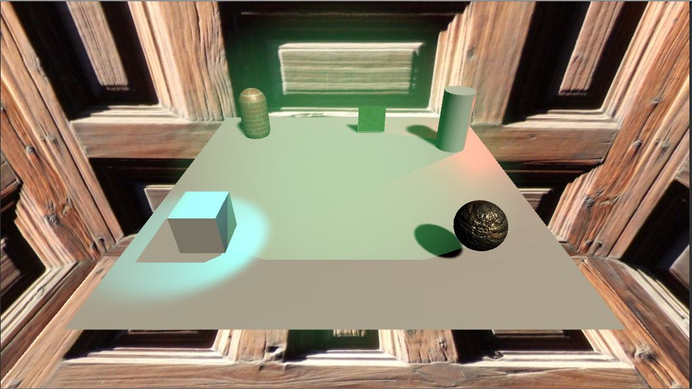
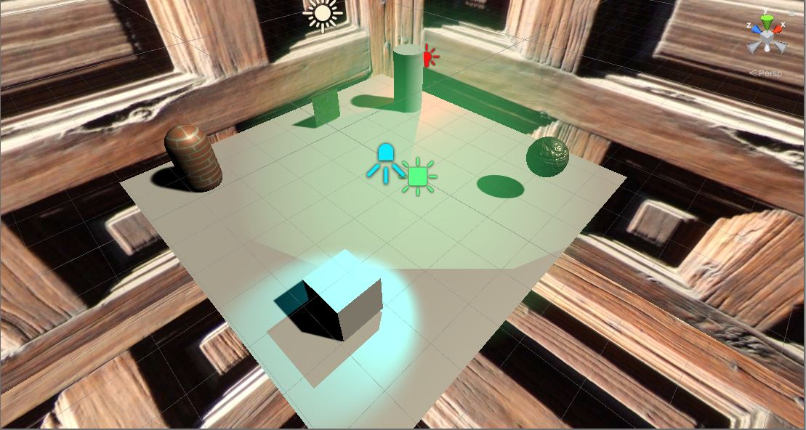
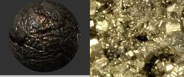
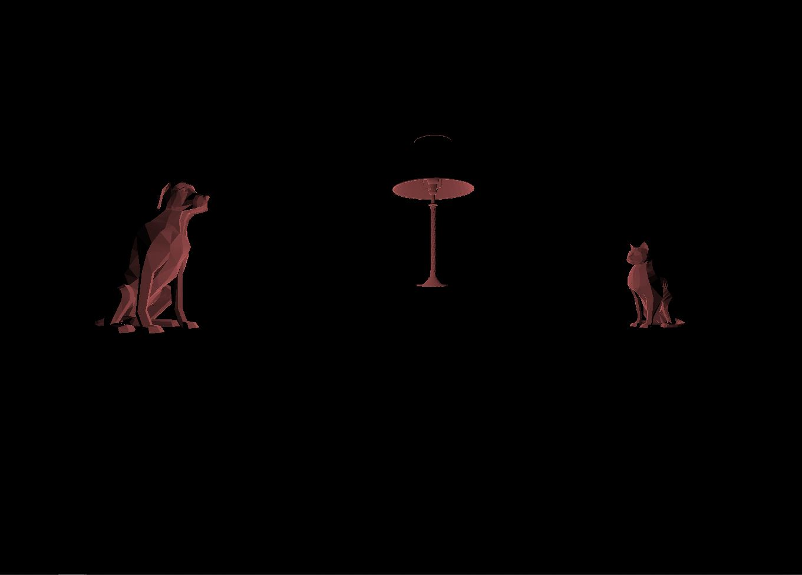

# CMPM163Labs
Rammohan Ramanathan Repository for CMPM163 Labs

Lab 6  

I chose to do Part 1 of the assignment to get even more experience with Unity.  

i. Screenshot:  
  
  

ii. Definition of lights  
Point Light: Behaves like a light bulb illuminating objects with respect to its position.  
Directional Light: Behaves like the sun, affecting all objects in the scene, with respect to the game objects rotation.  
Spotlight: Behave like a flashlight, point in a direction and illumate all objects within a cone.  
Area Light: Shine in all directiosn to one side of a rectangular plane.  

iii.  
  

iv.  
My aim was to recreate the faux gold that is pyrite. I fetched a texture and normal map from the lab 4 drive.  
I picked one which most resembled stone, then applied those two maps to a new material in Unity.  
I then adjusted the tint on the material and how metallic and smooth it was to recreate a porous ore look.  

v.  
I used some texture files from lab 4 and overlayed them over a capsule model, and small panel. To do this I  
created a new material and added these textures as the albedo, using the standard shader.  

vi.  
The skybox I created utilizes 1 texture placed on all six sides of a box (cube-map). The settings that were changed  
were that the texture should ideally clamp, to prevent repetition of tiles. I also slightly adjusted the contrast.  

Lab 5  
I chose to do Part 1 of this assignment to get some more experience with Unity.  

Video Link: https://drive.google.com/file/d/1cTUXYt4gkKK4MNhIbJcKjXFWBb9g8-78/view?usp=sharing  

Modifcations made:  
The skybox  
	- I used the original textures provided by the karting mod, and adjusted the tint to create a new skybox.  
Postprocessing  
	- I changed the postprocessing effect to the 'dreamlike' effect.  
Non-graphical related changes  
	- I added a trail to the wheels of the kart
	- I changed the colors of both the kart and the player
	- When the player crosses the finish line, confetti flies into the air.  

Lab 4

Video:  
https://drive.google.com/file/d/16q-gHV55yYRGWPdb8ebGtwht5EgVlpuQ/view?usp=sharing  

Questions:  

A. x = u * (xsize - 1) (in this case 8 is the max, -1 to account for 'off by one');  
e.g. 1 on the uv coordinate corresponds to 7 on the texture map.  

B. y = u * (ysize - 1) (in this case it is also 7).  

C. uv = (.375, .025);  
x = .375 * (8 - 1) = 2.625 -> corresponds to cell 2, x = 2.  
y = .25 * (8 - 1) =  1.75  -> correspongs to cell 1, y = 1.  
Our x,y coords are (2, 1), which is the color blue.

Cube descriptions:  

Middle Cube: Done through lab tutorial utilizing both a texture and normal map.  
Left Cube: Done through lab tutorial only using a texture.  
Top Cube: Similar to middle cube, however different texture and normal map used.  
Right Cube: Done through lab tutorial using a texture, and shaders provided by the tutorial.  
Bottom Cube: Similar to right cube in that it has a unique texture, and uses a fragment shader I built.  
Disclaimer for bottom cube:  
I do not believe I tiled the cube the intended way. The code I wrote is a hard coded solution and is not modular  
to tiling it to other nxn basis. To do so would involve changing raw numbers, and adding additional if statements.  
I am unsure of the proper way to do this, but here is the code used in the shader:  
uniform sampler2D texture1;  
varying vec2 vUv;  
void main() { //hard coded solution  
	vec2 spare = vUv * 2.0;  //map the cube such that coordinates fetch values 2x their original (2x for 2x2)  
	if (vUv.x > 0.5) spare.x -= 1.0;  //since this will cause some values to try and fetch values  
	if (vUv.y > 0.5) spare.y -= 1.0;  //outside of unit texture square, adjust for the error  
	gl_FragColor = texture2D(texture1, spare);  
}

Lab3 Links:  
Part 2: https://drive.google.com/file/d/1Q_Xl388GIunBRm3e0988SyaHAZ47sUbg/view?usp=sharing  
Explanation:  
Left Most Box: Done using three.js's toon mesh. Messed around with some values and created a blue box that emits a green light source.  
Middle box: Done using three.js's phong mesh. Specular reflection of the box is green.  
Middle Top box: Done using the labs vertex shader, and my own fragment shader. The shader mixes colors interpolated between the values of 0 and 1 using the sin function as the method. In this case there is a red line through the vertical axis of the cube.  
Right Most Box: Middle Top box: Done using this labs own vertex/fragment shaders that emulated interpolation. Uses two selected colors and interpolates the surface and edges of the cube. In this case Blue and Pink. (by means of a fragment shader)  
CREDIT for the sin function interpolation:  
https://thebookofshaders.com/glossary/?search=mix  

Lab2 Links:
Part 1: https://drive.google.com/file/d/1Hw4BlqXoqO094mhvTNWDlyMn55mdEmJ7/view?usp=sharing  
Part 2:  

