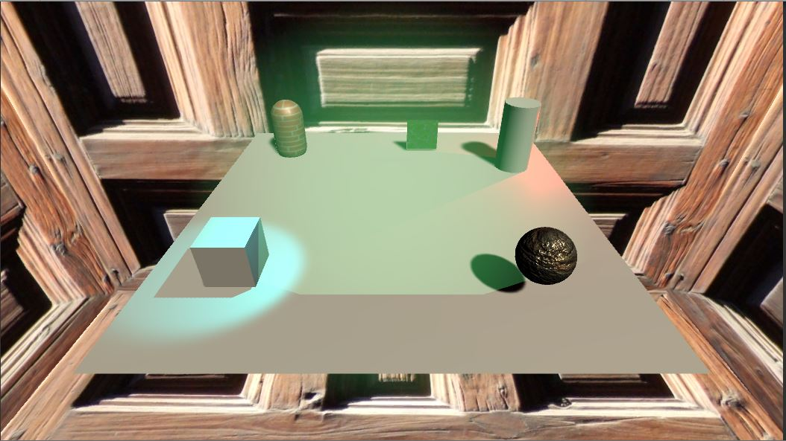
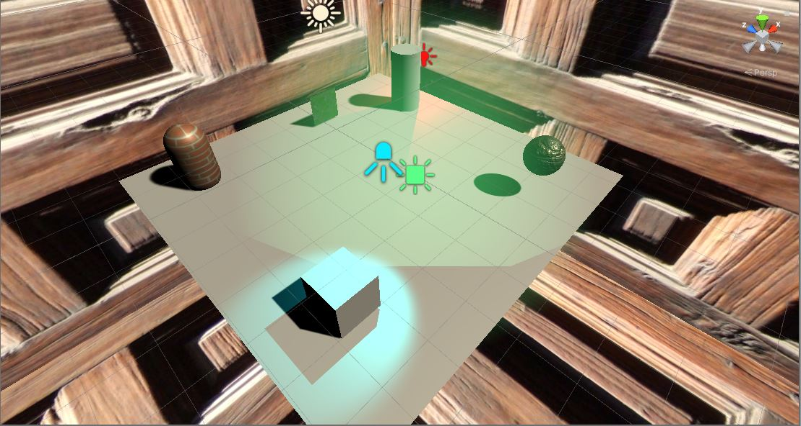

# CMPM163Labs
Rammohan Ramanathan Repository for CMPM163 Labs

Lab 6  

I chose to do Part 1 of the assignment to get even more experience with Unity.  

i. Screenshot:  
  
  

ii. Definition of lights  
Point Light: Behaves like a light bulb illuminating objects with respect to its position.  
Directional Light: Behaves like the sun, affecting all objects in the scene, with respect to the game objects rotation.  
Spotlight: Behave like a flashlight, point in a direction and illumate all objects within a cone.  
Area Light: Shine in all directiosn to one side of a rectangular plane.  

iii.  
  

iv.  
My aim was to recreate the faux gold that is pyrite. I fetched a texture and normal map from the lab 4 drive.  
I picked one which most resembled stone, then applied those two maps to a new material in Unity.  
I then adjusted the tint on the material and how metallic and smooth it was to recreate a porous ore look.  

v.  
I used some texture files from lab 4 and overlayed them over a capsule model, and small panel. To do this I  
created a new material and added these textures as the albedo, using the standard shader.  

vi.  
The skybox I created utilizes 1 texture placed on all six sides of a box (cube-map). The settings that were changed  
were that the texture should ideally clamp, to prevent repetition of tiles. I also slightly adjusted the contrast.  
