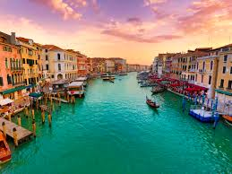
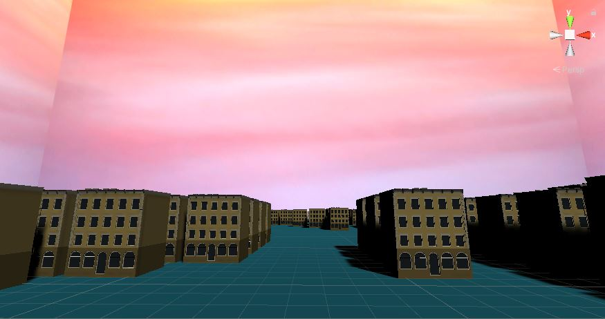

Lab 8
Note: tutorial for city provided by:  
https://www.youtube.com/channel/UCp_SOgsRYdLfIEWLjM62ZJg  
Holistic3d  

Skybox art created by:  
Ferdinand Stohr  

A. Part 1 Unity
B.  
i.  Inspired City: Venice  
  

ii. My rendition:  

iii. 
When I thought about building the city on water I realized I could take advantage of  
Holistic3D's algorithm for creating roads in the city. I essentially replaced the calls  
that placed down the streets wtih nothing, so that the place from underneath would show through  
and emulate water.  I also adjusted some minor values to affect the frequency of building verses water.  
The effect that comes through is a city that seemingly has water ways as well as ponds of water.  

D.
I have checked in and talked with my partner over discord, however I believe I finished this lab assignment ahead of them  
and I am also planning on turning it in ASAP.  

E.
Thus far I have not helped my partner.  