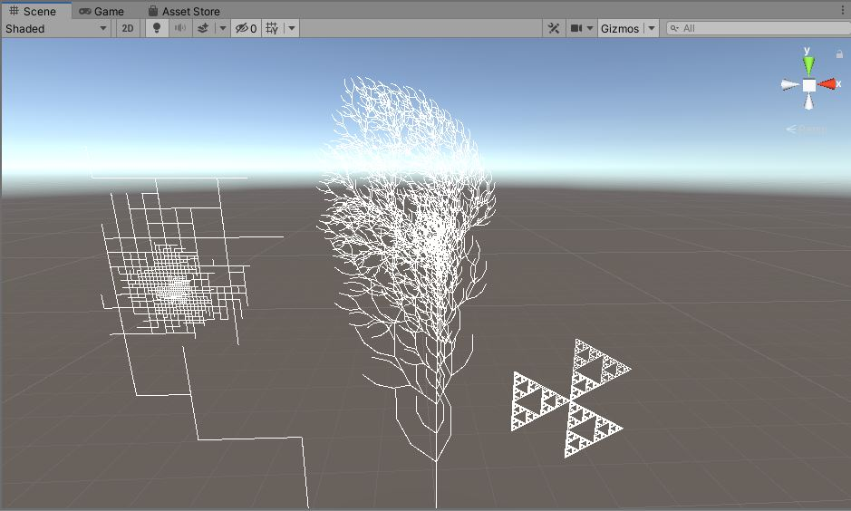

# CMPM163Labs
Rammohan Ramanathan Repository for CMPM163 Labs

Lab 9  
A. Part 1 Unity  
B. i. & ii.    
  
iii. I went to the wiki for Lsystems and started by making the Sierpinski Triangle.  
Afterwards I made my own variant of the dragoncurve, that utilizes the technique from the tutorial  
which utilizes a stack to preserve an object previous position/rotation. This way the dragon curve now  
had branching paths and curves upwards.  
